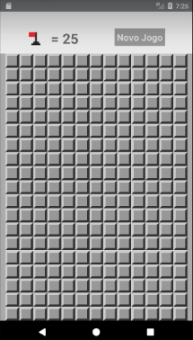

# Mines

<h3>Projeto desenvolvido durante o curso de React Native.</h3>

<b>Versão do React Native:</b> 
<a href="https://facebook.github.io/react-native/docs/0.59/getting-started
">0.59.10</a> 

<b>Versão do Node:</b> 
v12.14.1

<b>Versão do Java:</b> 
openjdk version "1.8.0_232" 
OpenJDK Runtime Environment (build 1.8.0_232-8u232-b09-0ubuntu1~18.04.1-b09) 
OpenJDK 64-Bit Server VM (build 25.232-b09, mixed mode) 

<b>Versão do NPM:</b> 
v6.13.4

<b>Sistema operacional:</b> 
<a href="https://xubuntu.org/">Xubuntu 18.04</a>

<h1>Campo minado</h1>

